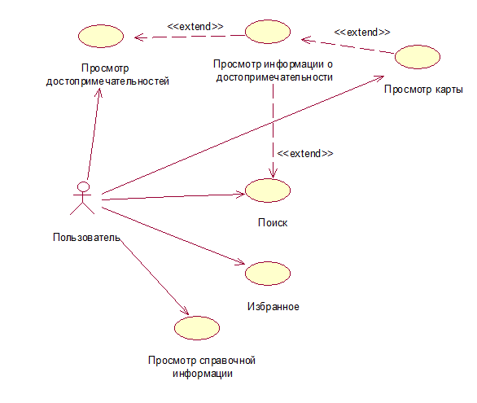

# UML Диаграммы

# 1 Диаграмма прецедентов
Диаграмма прецедентов имее следующий вид:

## 1.1 Актёры
| Актёр | Требования | 
|:---|:---|
| Пользователь | Человек, использующий приложение и имееющий доступ ко всему функционалу.   |

## 1.2 Варианты использования

<a name="landmarks_list"/>

### 1.2.1 Просмотр достопримечательностей
**Описание**: Вариант использования "Просмотр достопримечательностей" позволяет пользователю приложения просматривать список достопримечательностей. Поток событий:  
1.  Пользователь выбирает достопримечательность из списка.
2.  Пользователь переходит к окну [просмотра информации об достопримечательности](#landmark_info).
3.  Пользователь нажимает на иконку "Избранное".При данном действии выполняется альтернативный поток А1.
4.  Пользователь нажимает на иконку "Карта". При данном действии выполняется альтернативный поток А2.
5.  Пользователь нажимает на иконку "Поиск". При данном действии выполняется альтернативный поток А3.
6.  Пользователь нажимает на иконку "Справочная информация". При данном действии выполняется альтернативный поток А4.
7.  Конец. Альтернативный поток А1:
8.  Открывается окно ["Избранное"](#favorites).
9.  Конец. Альтернативный поток А2:
10.  Открывается окно ["Карта с достопримечательностями"](#landmarks_map).
11.  Конец. Альтернативный поток А3:
12.  Открывается окно ["Поиск"](#search_landmarks_by_name).
13.  Конец. Альтернативный поток А4:
14.  Открывается окно ["Справочная информация"](#info). 
15.  Конец.

<a name="landmark_info"/>

### 1.2.2 Просмотр информации о достопримечательности
**Описание**: Вариант использования "Просмотр информации о достопримечательности" позволяет пользователю приложения просматривать подробную информацию про достопримечательность. Поток событий:  
1.  Пользователь нажимает на координаты. При данном действии выполняется альтернативный поток А1.
2.  Пользователь нажимает на иконку "Назад". При данном действии выполняется альтернативный поток А2.
3.  Пользователь нажимает на иконку "Добавить в избранное". При данном действии выполняется альтернативный поток А3.
4.  Конец. Альтернативный поток А1:
5.  Открывается окно ["Карта маршрута"](landmark_on_map).
6.  Конец. Альтернативный поток А2:
7.  Открывается окно ["Просмотра достопримечательностей"](#landmarks_list).
8.  Конец. Альтернативный поток А3:
9.  Достопримечательность добавляется в избранное.
10.  Конец.

<a name="landmark_on_map"/>

### 1.2.3 Просмотр маршрута на карте
**Описание**: Вариант использования "Просмотр маршрута на карте" позволяет пользователю приложения просматривать маршрут к достопримечательности на карте. Поток событий:  
1.  Пользователь нажимает на иконку "Назад".
2.  Открывается окно ["Просмотр информации о достопримечательности"](#landmark_info).
3.  Конец.

<a name="landmarks_map"/>

### 1.2.4 Просмотр карты с достопримечательностями
**Описание**: Вариант использования "Просмотр карты с достопримечательностями" позволяет пользователю приложения просматривать достопримечательности, отмеченные маркерами, на карте. Поток событий:  
1.  Пользователь нажимает на иконку "Назад".
2.  Открывается окно ["Просмотра достопримечательностей"](#landmarks_list).
3.  Конец.

<a name="search_landmarks_by_name"/>

### 1.2.5 Поиск достопримечательности по названию
**Описание**: Вариант использования "Поиск достопримечательности по названию" позволяет пользователю приложения выполнить полный либо частичный поиск по названию. Поток событий: 
1.  Пользователь вводит название достопримечательности.
2.  Отображается список с полным либо частичным совпадение названия.
3.  Пользователь выбирает достопримечательность из списка. При данном действии выполняется альтернативный поток А1.
4.  Пользователь нажимает на иконку "Назад". При данном действии выполняется альтернативный поток А2.
5.  Конец. Альтернативный поток А1:
6.  Пользователь переходит к окну [просмотра информации об достопримечательности](#landmark_info).
7. Конец. Альтернативный поток А2:
8. Открывается окно ["Просмотра достопримечательностей"](#landmarks_list).
9.  Конец.

<a name="favorites"/>

### 1.2.6 Избранное
**Описание**: Вариант использования "Избранное" позволяет пользователю приложения просмотреть список достопримечательностей, добавленных в "Избранное" . Поток событий: 
1.  Пользователь выбирает достопримечательность из списка. При данном действии выполняется альтернативный поток А1.
2.  Пользователь нажимает на иконку "Назад". При данном действии выполняется альтернативный поток А2.
3.  Конец. Альтернативный поток А1:
4.  Пользователь переходит к окну [просмотра информации об достопримечательности](#landmark_info).
5. Конец. Альтернативный поток А2:
6. Открывается окно ["Просмотра достопримечательностей"](#landmarks_list).
7.  Конец.

<a name="info"/>

### 1.2.7 Справочная информация
**Описание**: Вариант использования "Справочная информация" позволяет пользователю приложения получить актуальную информацию о приложении. Поток событий: 
1.  Пользователь нажимает на иконку "Назад".
2.  Открывается окно ["Просмотра достопримечательностей"](#landmarks_list).
3.  Конец.