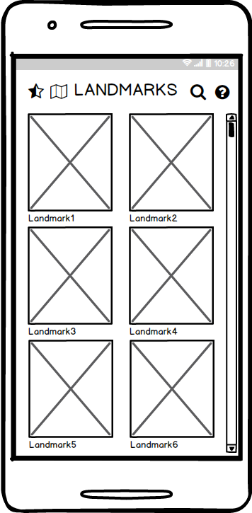
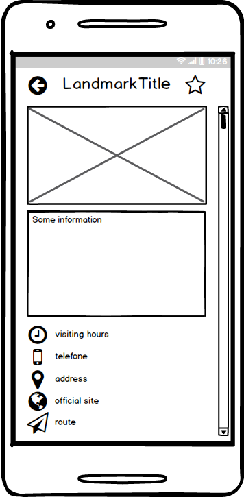
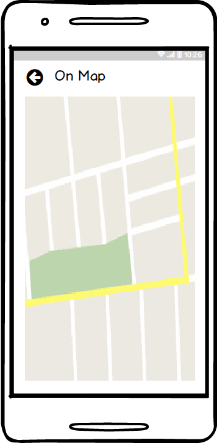
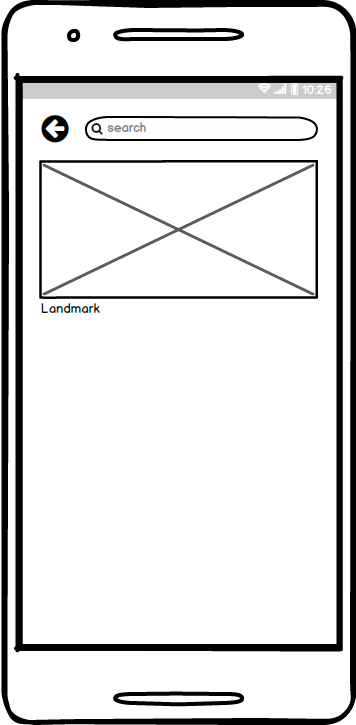
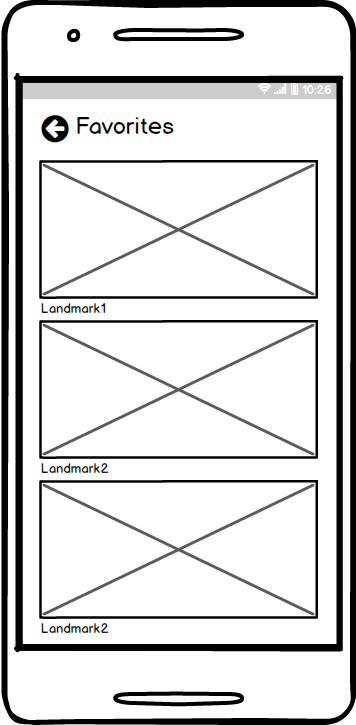
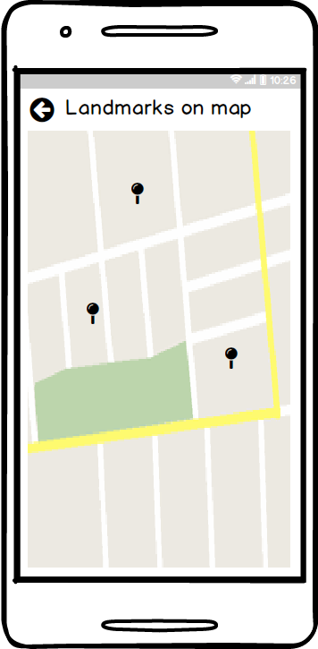
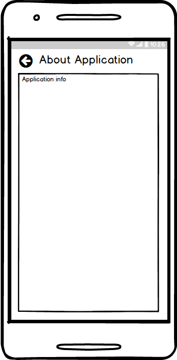

# Требования к проекту
---

# Содержание
1 [Введение](#intro)  
1.1 [Назначение](#appointment)  
1.2 [Бизнес-требования](#business_requirements)  
1.2.1 [Исходные данные](#initial_data)  
1.2.2 [Возможности бизнеса](#business_opportunities)  
1.2.3 [Границы проекта](#project_boundary)  
1.3 [Аналоги](#analogues)  
2 [Требования пользователя](#user_requirements)  
2.1 [Программные интерфейсы](#software_interfaces)  
2.2 [Интерфейс пользователя](#user_interface)  
2.3 [Характеристики пользователей](#user_specifications)  
2.3.1 [Аудитория приложения](#application_audience)   
2.4 [Предположения и зависимости](#assumptions_and_dependencies)  
3 [Системные требования](#system_requirements)  
3.1 [Функциональные требования](#functional_requirements)  
3.1.1 [Основные функции](#main_functions)   
3.1.1.1 [Просмотр списка достопримечательностей](#landmarks_list)  
3.1.1.2 [ Просмотр подробной информации о достопримечательности](#landmark_info)  
3.1.1.3 [Просмотр маршрута на карте](#landmark_on_map)  
3.1.1.4 [Просмотр карты с достопримечательностями](#landmarks_map)  
3.1.1.5 [Поиск достопримечательности по названию](#search_landmarks_by_name)  
3.1.1.6 [Избанные досторимечательности](#favorites)  
3.2 [Нефункциональные требования](#non-functional_requirements)  
3.2.1 [Атрибуты качества](#quality_attributes)  
3.2.1.1 [Требования к удобству использования](#requirements_for_ease_of_use)  
3.2.2 [Ограничения](#restrictions)  

### Глоссарий
* SQLite — компактная встраиваемая реляционная база данных, которая поддерживает достаточно полный набор команд SQL и доступна в исходных кодах (на языке C). Исходные коды SQLite находятся в public domain, то есть вообще никаких ограничений на использование.

<a name="intro"/>

# 1 Введение

<a name="appointment"/>

## 1.1 Назначение
В этом документе описаны функциональные и нефункциональные требования к мобильному приложению «MinskLandmarks» для операционной системы Android.

<a name="business_requirements"/>

## 1.2 Бизнес-требования

<a name="initial_data"/>

### 1.2.1 Исходные данные
Минск - столица Республики Беларусь, город с почти тысячелетней историей. В то же время, это и современный быстрорастущий двухмиллионный город. Поэтому в городе есть как исторические, так и современные достопримечательности, а также большое количество парков. В мобильном приложении «MinskLandmarks» жители и гости Минска с легкостью смогут исследуйте этот красивый город и построить маршрут до интересующего места.

<a name="business_opportunities"/>

### 1.2.2 Возможности бизнеса
Используя приложение, можно в значительной мере сократить затраты на туристическую поездку, так как все самое важное собрано в телефоне. Нет нужды заказывать туристическую поездку, а возможно ее спланировать самостоятельно, отправляясь в те места и города, которые больше всего интересуют, а короткие описания позволят получить основную информацию по объекту.

<a name="project_boundary"/>

### 1.2.3 Границы проекта
Приложение «MinskLandmarks» позволялит любому пользователю получить описание со всей необходимой контактной информацией об интересующем культурно-историческом объекте, и построить маршрут до него.

<a name="analogues"/>

## 1.3 Аналоги
 Функции |[Путеводитель по Беларуси](https://play.google.com/store/apps/details?id=com.cityguideby)| [Достопримечательности Минска](https://play.google.com/store/apps/details?id=by.tut.pavelpetro.sightsofminsk)
--- | :-: | :-:
Добавление и создание фото | +|+
Работа без интернета | +|-
Добавление в избранное | +|-
Другие места, помимо достопримечательностей(например гостиницы,магазины, рестораны) | -|+

<a name="user_requirements"/>

# 2 Требования пользователя

<a name="software_interfaces"/>

## 2.1 Программные интерфейсы
Приложение использует API [MapKit – мобильный SDK](https://tech.yandex.ru/maps/mapkit/).

<a name="user_interface"/>

## 2.2 Интерфейс пользователя  
Список достопримечательностей.  
  
Информация о достопримечательности.  
  
Отображение маршрута на карте.  
  
Поиск по названию.  
    
Избранные достопримечательности.  
  
Достопричательности на карте.  
  
Информация о приложении.  

<a name="user_specifications"/>

## 2.3 Характеристики пользователей

<a name="user_classes"/>

### 2.3.1 Аудитория приложения

Люди, которые хотят посетить интересные места в Минске.
<a name="assumptions_and_dependencies"/>

## 2.4 Предположения и зависимости
1. Построение маршрута не работает при отсутствии подключения к Интернету.

<a name="system_requirements"/>

# 3 Системные требования

<a name="functional_requirements"/>

## 3.1 Функциональные требования

<a name="main_functions"/>

### 3.1.1 Основные функции

<a name="landmarks_list"/>

#### 3.1.1.1 Просмотр списка достопримечательностей
**Описание.** Пользователь должен видеть список достопримечательностей.

| Функция | Требования | 
|:---|:---|
| Отображение достопримечательностей | При выборе достопримечательности пользователь должен увидеть подробную иформацию.   |  

<a name="landmark_info"/>

#### 3.1.1.2 Просмотр подробной информации о достопримечательности
**Описание.** Отображение справочной информации, часах посещения, телефона, адреса, сайта, координат местоположения для построения маршрута. Добавление в избранное.

| Функция | Требования | 
|:---|:---|
| Добавление в избранное | При нажании на сообтветствующую иконку, достопримечательность должна быть добавлена в избранное.   |
| Построение маршрута | При нажатии на координаты происходит переход к окну с картой маршрута от текущего местоположения.   |

<a name="landmark_on_map"/>

#### 3.1.1.3 Просмотр маршрута на карте
**Описание.** Пользователь должен иметь возможность просматривать маршрут на карте с отображением его местоположения.

| Функция | Требования | 
|:---|:---|
| Отображение маршрута на карте | Маршрут должен быть от текущего местоположения пользователя к заданной точке, по дороге.   |

<a name="landmarks_map"/>

#### 3.1.1.4 Просмотр карты с достопримечательностями
**Описание.** Пользователь должен иметь возможность простматривать карту, на которой маркерами обозначены достопримечательности.

| Функция | Требования | 
|:---|:---|
| Отображение карты с достопримечательностями, отмеченными маркерами | Маркеры должны соответствовать реальному местоположению объектов и пользователя.|

<a name="search_landmarks_by_name"/>

#### 3.1.1.5 Поиск достопримечательности по названию
**Описание.** Пользователь должен иметь возможность поиска достапримечательности по названию.

| Функция | Требования | 
|:---|:---|
| Нахождение достопримечательности | При вводе названия отображаются достопримечательности с полным или частичным совпаданием названия.    |  
| Отображение достопримечательностей | При выборе достопримечательности пользователь должен увидеть подробную иформацию.   |

<a name="favorites"/>

#### 3.1.1.6 Избранные достопримечательности
**Описание.** Пользователь должен иметь возможность просмотра избранных достопримечательностей.

| Функция | Требования | 
|:---|:---|
| Отображение списка достопримечательностей | Отображается список достопримечательностей, добавленых в "Избранное"  |

<a name="non-functional_requirements"/>

## 3.2 Нефункциональные требования

<a name="quality_attributes"/>

### 3.2.1 Атрибуты качества

<a name="requirements_for_ease_of_use"/>

#### 3.2.1.1 Требования к удобству использования
1. Плавный интерфейс;
2. Разделы должны быть подписаны;
3. Масштабируемость.

<a name="restrictions"/>

### 3.2.2 Ограничения
* Приложение доступно для смартфонов с версией Android 6.0 и выше
* Приложение реализована на языке Java
* Приложение не отображает карту при отсутствии Интернет-соединения
